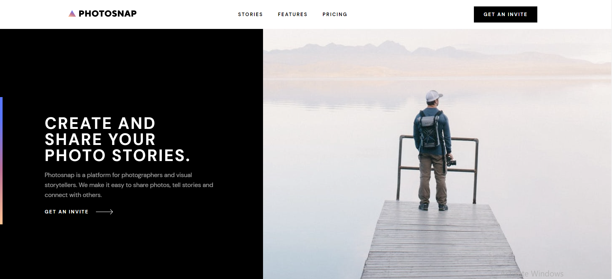

# Frontend Mentor - Photosnap Website solution

This is a solution to the [Photosnap Website challenge on Frontend Mentor](https://www.frontendmentor.io/challenges/photosnap-multipage-website-nMDSrNmNW). Frontend Mentor challenges help you improve your coding skills by building realistic projects.

## Overview

### The challenge

Users should be able to:

- View the optimal layout for each page depending on their device's screen size
- See hover states for all interactive elements throughout the site

### Screenshot

### Links

- Solution URL: [Github](https://github.com/beqa200/photosnap-multi-page-website-011.git)
- Live Site URL: [Vercel](https://photosnap-multi-page-website-011.vercel.app/)

## My process

### Built with

- Semantic HTML5 markup
- CSS custom properties
- Flexbox
- Mobile-first workflow

### What I Learned

New technologies we learned
Best practices for web development
Lessons we learned about collaboration

## Author

Beka Merebashvili - [LinkedIn](https://www.linkedin.com/in/beka-merebashvili-a04554248/)
Beka Abuladze - [LinkedIn](https://www.linkedin.com/in/beka-abuladze-50a344217/)

## mentor

Beka Maisuradze 
